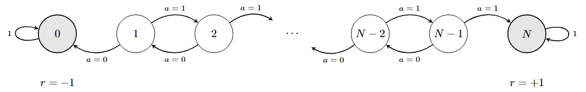

# Reinforcement Learning Algorithms

This repository contains tabular reinforcement learning implementations written in JAX.

## n-step Q($\sigma$)

The n-step Q($\sigma$) algorithm is a temporal-difference control method that unifies sampled and expected multi-step backups. It interpolates between Sarsa-style learning and Tree Backup-style learning through the parameter $\sigma \in [0,1]$.

For a state-action value function $Q(s,a)$, the algorithm constructs an n-step return recursively as

$$
    G_{t:h} = R_{t+1}
    + \gamma \left[\sigma_{t+1}\rho_{t+1} + (1-\sigma_{t+1})\pi(A_{t+1}\mid S_{t+1})\right]
    \left[G_{t+1:h} - Q_{h-1}(S_{t+1}, A_{t+1})\right]
    + \gamma \bar V_{h-1}(S_{t+1}),
$$

where

$$
    \bar V_{h-1}(s) =\sum_a \pi(a \mid s) Q_{h-1}(s,a),
$$

and

$$
    \rho_t = \frac{\pi(A_t \mid S_t)}{b(A_t \mid S_t)}
$$

is the importance sampling ratio between the target policy $\pi$ and the behaviour policy $b$.

The action-value estimate is then updated using

$$
Q(S_\tau, A_\tau) \leftarrow Q(S_\tau, A_\tau) + \alpha\left[G_{\tau:h} - Q(S_\tau, A_\tau)\right].
$$

The parameter $\sigma$ determines the degree of sampling in the backup:

- $\sigma = 1$ gives the sampled n-step Sarsa-style update;
- $\sigma = 0$ gives the expected Tree Backup update;
- $0 < \sigma < 1$ gives a mixture of sampled and expected backups.

The implementation supports off-policy learning through the importance ratios $\rho_t$. The behaviour policy is currently $\epsilon$-greedy with respect to the current target policy, while the target policy can either be held fixed or updated greedily with respect to the current action-value estimates.

## Environment

The main test environment is a finite left/right random walk



The terminal states are $0$ and $N$. Reaching state $0$ gives reward $-1$, while reaching state $N$ gives reward $+1$. All intermediate rewards are zero.

At each non-terminal state, the agent chooses between two actions:

- $a=0$: attempt to move left;
- $a=1$: attempt to move right.

The intended move succeeds with probability $0.9$. With probability $0.1$, the agent slips and moves in the opposite direction. This gives a simple controlled Markov decision process in which the optimal policy is to move towards the positive terminal state while accounting for stochastic transitions.

The environment is useful for studying how the choice of $n$, $\sigma$, $\alpha$, $\gamma$, and $\epsilon$ affects the stability and speed of off-policy value learning.

## Repository Structure

```text
.
├── algorithms/
│   ├── bandit/
│   ├── dp/
│   ├── mc/
│   ├── td/
│   ├── utils/
│   └── __init__.py
├── experiments/
│   ├── bandit_testbed/
│   └── __init__.py
│   ├── q_learning/
│   └── __init__.py
├── reinforcement_learning.egg-info/
├── venv/
├── .gitignore
├── ql_env.png
├── README.md
├── requirements.txt
└── setup.py
```